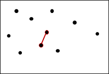

# Closest_Points_Divide_And_Conquer

Ce projet d'algorithmique vise à implémenter une solution efficace pour trouver les deux points les plus proches dans un ensemble de points en utilisant la méthode "Diviser pour Régner". L'algorithme sera capable de gérer de grandes quantités de données en exploitant une approche récursive de complexité optimale. Le résultat sera un programme performant et précis, pouvant être utilisé dans diverses applications nécessitant l'identification des paires de points les plus proches, telles que la géolocalisation, la vision par ordinateur ou l'analyse de données spatiales.

